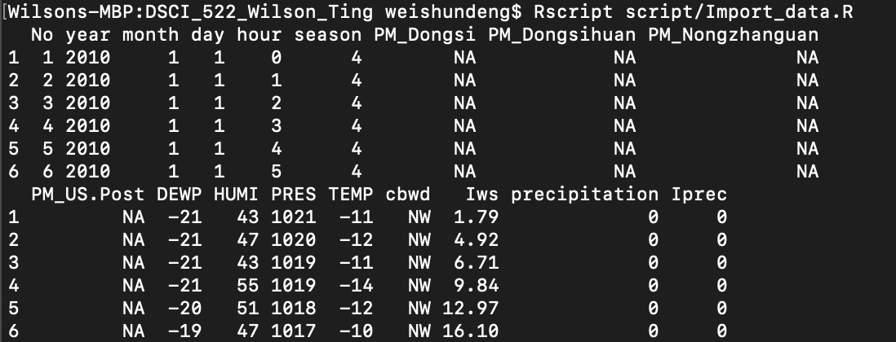

# DSCI_522_Wilson_Ting
Data analysis project for DSCI 522

## Team members

[Wilson Deng](https://github.com/xiaoweideng)

[Ting Pan](https://github.com/panntingg)


## Data
Source: [PM2.5 Data of Five Chinese Cities from Kaggle.com](https://www.kaggle.com/uciml/pm25-data-for-five-chinese-cities)

### Proof of loading data

```
Rscript Import_data.R
```



- Context
<br> PM2.5 readings are often included in air quality reports from environmental authorities and companies. PM2.5 refers to atmospheric particulate matter (PM) that have a diameter less than 2.5 micrometers. In other words, it's used as a measure of pollution. 

- Content
<br> The time period for this data is between Jan 1st, 2010 to Dec 31st, 2015. Missing data are denoted as NA. 


## Question

- Question: **Is the average PM2.5 of Beijing same as that of Shanghai during the period between Jan 1st, 2010 to Dec 31st, 2015?**

- Type of Question: Exploratory.

## Plan

We plan to do a **hypothesis test** over the two datasets. Also, two-tailed test will be applied to our question.

## Summarize the data

We will perform data wrangling over our datasets, and then create a visualization of the data that shows the estimate, confidence intervals and distribution for each sample. We will also visualize the cut-off for the significance level and our test statistic on the visualization.
