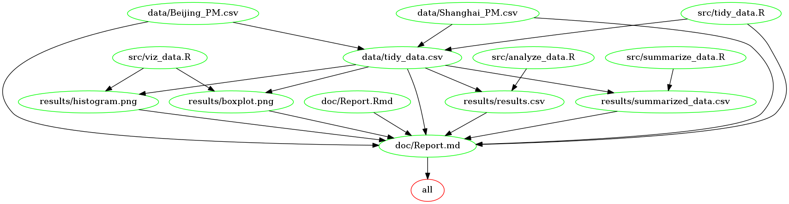

# DSCI 522 Analysis of PM 2.5 in Beijing and Shanghai
Data analysis project for DSCI 522 - Analyzing PM 2.5 in Beijing and Shanghai

## Team members

[Wilson Deng](https://github.com/xiaoweideng)

[Ting Pan](https://github.com/panntingg)

## Summary

Particulate matter(PM) - also known as Atmospheric aerosol particles - are microscopic solid or liquid matter suspended in the atmosphere of Earth. PM2.5 are fine particles with a diameter of 2.5 μm or less. They have impacts on climate and precipitation that adversely affect human health. In other words, it's used as a measure of pollution.

PM2.5 readings are often included in air quality reports from environmental authorities and companies. We collect our data from [PM2.5 Data of Five Chinese Cities from Kaggle.com](https://www.kaggle.com/uciml/pm25-data-for-five-chinese-cities). The time period for this data is between Jan 1st, 2010 to Dec 31st, 2015. PM2.5 data are collected each hour each day from several locations of each city. The missing data are denoted as NA.

This data analysis project deals one inferential question: **Is the average PM2.5 in Beijing same as that in Shanghai?** We would perform hypothesis testing for the difference between two population means of PM2.5 in Beijing and Shanghai, and conduct a two-sample t-test of the null hypothesis. Also, necessary visualization and interpretation are included.

As a result, we have sufficient evidence to reject the claim that the average PM2.5 in Beijing and Shanghai are the same.

## Usage

1. Clone this repo, and using the command line, navigate to the root of this project.

2. Run the following commands:

```
make all
```
This would run all the scripts, create summarized table and graphs and render the final report.

<br> OR you could run scrapts respectively.

```
# run tidy_data.R, input two raw datasets and output tidy data
# dependency: tidyverse
make data/tidy_data.csv
# run viz_data.R, input tidy data and output two figures
# dependency: tidyverse
make results/histogram.png
# run summarize_data.R, input tidy data and output summarized data
# dependency: tidyverse
make results/summarized_data.csv
# run analyze_data.R, input tidy data and output results
# dependency: tidyverse, broom
make results/results.csv
# input all above results and render md version of the report
# dependency: rmarkdownm, knitr, tidyverse and plyr
make doc/Report.md
```

You could find our final report in the `doc` folder after running the script. OR you could click [Final Report](https://github.com/UBC-MDS/DSCI_522_PM2.5_Analysis/blob/master/doc/Report.md).

The following command cleans outputs.
```
make clean
```

The following is the dependency diagram of the Makefile:



<br> To run this analysis using Docker, clone/download this repository, use the command line to navigate to the root of this project on your computer, and then type the following (filling in PATH_ON_YOUR_COMPUTER with the absolute path to the root of this project on your computer).

```
docker run --rm -v PATH_ON_YOUR_COMPUTER:/home/dsci_522_pm2.5_analysis wilsondeng/dsci_522_pm2.5_analysis make -C '/home/dsci_522_pm2.5_analysis' all
```

To clean up the analysis type:

```
docker run --rm -v PATH_ON_YOUR_COMPUTER:/home/dsci_522_pm2.5_analysis wilsondeng/dsci_522_pm2.5_analysis make -C '/home/dsci_522_pm2.5_analysis' clean
```


## Dependencies

- R Version 3.5.1

- R libraries:
    - `rmarkdown` Version 1.10
    - `knitr` Version 1.20
    - `tidyverse` Version 1.2.1
    - `broom` Version 0.5.0
    - `plyr` Version 1.8.4

## Release Version

- [Version 3.0](https://github.com/UBC-MDS/DSCI_522_PM2.5_Analysis/tree/V3.0)
- [Version 2.0](https://github.com/UBC-MDS/DSCI_522_PM2.5_Analysis/tree/v2.0)
- [Version 0.1](https://github.com/UBC-MDS/DSCI_522_PM2.5_Analysis/tree/v0.1)
