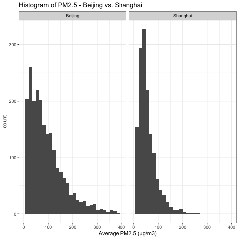
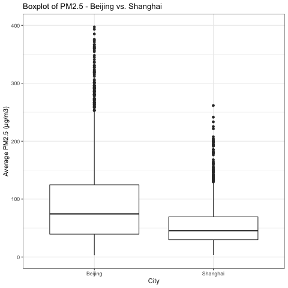

# Report

*requirement: introduces and justifies your question, introduces the data set, presents the findings/results, and interprets the findings/results in context of the question. Some critique of the analysis is also expected (limitations, assumptions, etc) and a statement of future directions (what would you do next if you had more time to work on this). The report is expected to be 1-2 written pages (excluding figures, tables and references). You are expected to have a reference section and cite 2-3 external sources (data source can be one of these citations).*
 
## Introduction
This project is to conduct research on the inferential question - **Is the average PM2.5 in Beijing same as that in Shanghai?** We want to explore whether the average PM2.5 in Beijing is different from that in Shanghai in general. The datasets we choose are [PM2.5 Data of Five Chinese Cities from Kaggle.com](https://www.kaggle.com/uciml/pm25-data-for-five-chinese-cities), which record PM2.5 of five Chinese cities during 2010 to 2015. Because we only care about PM2.5 in Beijing and Shanghai, these two raw datasets are as below:

```{r, echo = FALSE}
library(knitr)
BJ_data <- read.csv("../data/Beijing_PM.csv")
SH_data <- read.csv("../data/Shanghai_PM.csv")
```

*Table 1. Beijing PM2.5 Raw Dataset*
```{r, echo = FALSE}
kable(head(BJ_data))
```


*Table 2. Shanghai PM2.5 Raw Dataset*
```{r, echo = FALSE}
kable(head(SH_data))
```

To analyze the data efficiently, we need to do data wrangling on `Table 1` and `Table 2`:

* For each table, add a column `PM_Average` to record the average daily PM2.5.

* For each table, add a column `city` to indicate this categorical variable.

* Combine the two tables into one, which is `Table 3`.

*Table 3. Beijing and Shanghai PM2.5 Tidy Dataset*

```{r, echo = FALSE}
BJSH_data <- read.csv("../data/tidy_data.csv")
kable(head(BJSH_data))
```


## Visualization

To understand the dataset, we take two plots to visualize it.

### Histogram



It shows the distributions of PM2.5 in Shanghai and Beijing. Both are right-skewed. Looking at the distribution of Beijing, the peak occurs at 25, and the data spread is from about 0 to 400. In contrast, the peak in distribution of Shanghai occurs at 50, which is larger than that of Beijing. The data spread of Shanghai is from 0 to 250, which is much narrower.

### Boxplot



It helps analyze the relationship between the categorical variable `city` and the continuous variable `PM_Average`. We observe that the median PM2.5 of Beijing is higher than that of Beijing. Also, the boxplot of Shanghai is comparatively short, which suggests that overall PM2.5 values of Shanghai are denser. In addition, they both have much outliers, which reveals that ralatively high PM2.5 usually detected in both cities.

## Data Summary
summarized_data.csv
means, cis, ses

For each city, we can easily get the sample size, the sample mean, and the standard deviation of the sample mean. Then, assuming statistical independence of the two groups, the standard error of the mean of each city can be estimated as the sample standard deviation divided by the square root of the sample size `SE = s / sqrt(n)`. Additionally, we calculate 95% confidence interval of PM2.5 for each city. 1.96 is the approximate value of the 97.5 percentile point of the normal distribution, then CI can be calculated using `Confidence interval = (mean -  1.96 * SE, mean +  1.96 * SE)`.

*Table 4. Summarize Beijing and Shanghai PM2.5 Tidy Dataset*

```{r, echo = FALSE}
summarized_data <- read.csv("../results/summarized_data.csv")
kable(head(summarized_data))
```

From `Table 4`, the means PM of the Beijing and Shanghai are totally different. Also, we are 95% confident that the average PM in Beijing is between 91.98765 and 98.44522. Comparatively, we are 95% confident that the average PM in Shanghai is between 52.87362 and 56.74973.

## Analysis and results

*Welch two sample t test (Assumption[reference wiki]: not equal variance)
p value
reject h0
show plot*

*Table 5. Summarize Beijing and Shanghai PM2.5 Tidy Dataset*

```{r, echo = FALSE}
results <- read.csv("../results/results.csv")
kable(head(results),digits = 100)
```

Since p-value is smaller than 0.05, we reject the null hypothesis that there's no difference between the mean PM in Beijing and Shanghai. 

## Reference
