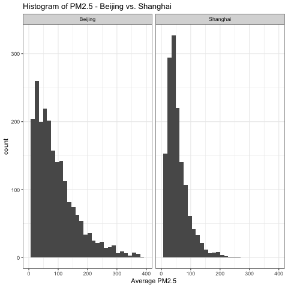
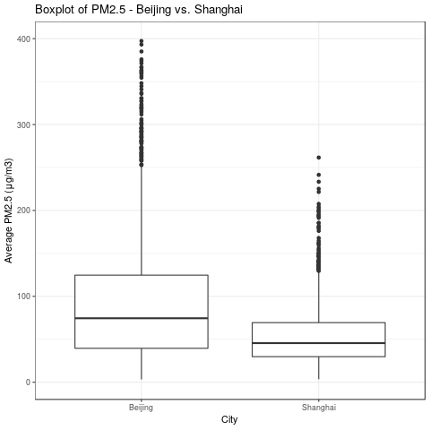
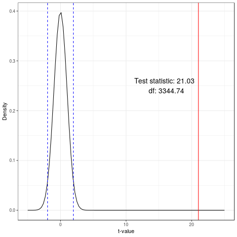

DSCI 522 Analysis of PM 2.5 in Beijing and Shanghai
================
Ting Pan, Weishun Deng
November 22, 2018

# Report

## Introduction

This project is to conduct research on the inferential question - **Is
the average PM2.5 in Beijing same as that in Shanghai?** We want to
explore whether the average PM2.5 in Beijing is different from that in
Shanghai in general. The datasets we choose are [PM2.5 Data of Five
Chinese Cities from
Kaggle.com](https://www.kaggle.com/uciml/pm25-data-for-five-chinese-cities),
which record PM2.5 of five Chinese cities during 2010 to 2015. Because
we only care about PM2.5 in Beijing and Shanghai, these two raw datasets
are as below:

*Table 1. Beijing PM2.5 Raw
Dataset*

| No | year | month | day | hour | season | PM\_Dongsi | PM\_Dongsihuan | PM\_Nongzhanguan | PM\_US.Post | DEWP | HUMI | PRES | TEMP | cbwd |   Iws | precipitation | Iprec |
| -: | ---: | ----: | --: | ---: | -----: | ---------: | -------------: | ---------------: | ----------: | ---: | ---: | ---: | ---: | :--- | ----: | ------------: | ----: |
|  1 | 2010 |     1 |   1 |    0 |      4 |         NA |             NA |               NA |          NA | \-21 |   43 | 1021 | \-11 | NW   |  1.79 |             0 |     0 |
|  2 | 2010 |     1 |   1 |    1 |      4 |         NA |             NA |               NA |          NA | \-21 |   47 | 1020 | \-12 | NW   |  4.92 |             0 |     0 |
|  3 | 2010 |     1 |   1 |    2 |      4 |         NA |             NA |               NA |          NA | \-21 |   43 | 1019 | \-11 | NW   |  6.71 |             0 |     0 |
|  4 | 2010 |     1 |   1 |    3 |      4 |         NA |             NA |               NA |          NA | \-21 |   55 | 1019 | \-14 | NW   |  9.84 |             0 |     0 |
|  5 | 2010 |     1 |   1 |    4 |      4 |         NA |             NA |               NA |          NA | \-20 |   51 | 1018 | \-12 | NW   | 12.97 |             0 |     0 |
|  6 | 2010 |     1 |   1 |    5 |      4 |         NA |             NA |               NA |          NA | \-19 |   47 | 1017 | \-10 | NW   | 16.10 |             0 |     0 |

*Table 2. Shanghai PM2.5 Raw
Dataset*

| No | year | month | day | hour | season | PM\_Jingan | PM\_US.Post | PM\_Xuhui | DEWP |  HUMI |   PRES | TEMP | cbwd | Iws | precipitation | Iprec |
| -: | ---: | ----: | --: | ---: | -----: | ---------: | ----------: | --------: | ---: | ----: | -----: | ---: | :--- | --: | ------------: | ----: |
|  1 | 2010 |     1 |   1 |    0 |      4 |         NA |          NA |        NA |  \-6 | 59.48 | 1026.1 |    1 | cv   |   1 |             0 |     0 |
|  2 | 2010 |     1 |   1 |    1 |      4 |         NA |          NA |        NA |  \-6 | 59.48 | 1025.1 |    1 | SE   |   2 |             0 |     0 |
|  3 | 2010 |     1 |   1 |    2 |      4 |         NA |          NA |        NA |  \-7 | 59.21 | 1025.1 |    0 | SE   |   4 |             0 |     0 |
|  4 | 2010 |     1 |   1 |    3 |      4 |         NA |          NA |        NA |  \-6 | 63.94 | 1024.0 |    0 | SE   |   5 |             0 |     0 |
|  5 | 2010 |     1 |   1 |    4 |      4 |         NA |          NA |        NA |  \-6 | 63.94 | 1023.0 |    0 | SE   |   8 |             0 |     0 |
|  6 | 2010 |     1 |   1 |    5 |      4 |         NA |          NA |        NA |  \-7 | 59.21 | 1023.0 |    0 | SE   |  11 |             0 |     0 |

To analyze the data efficiently, we need to do data wrangling on
`Table 1` and `Table 2`:

  - For each table, add a column `PM_Average` to record the average
    daily PM2.5.

  - For each table, add a column `city` to indicate this categorical
    variable.

  - Combine the two tables into one, which is `Table 3`.

*Table 3. Beijing and Shanghai PM2.5 Tidy Dataset*

| year | month | day | PM\_Average | city     |
| ---: | ----: | --: | ----------: | :------- |
| 2010 |     1 |   1 |    129.0000 | Beijing  |
| 2010 |     1 |   1 |          NA | Shanghai |
| 2010 |     1 |   2 |    144.3333 | Beijing  |
| 2010 |     1 |   2 |          NA | Shanghai |
| 2010 |     1 |   3 |     78.3750 | Beijing  |
| 2010 |     1 |   3 |          NA | Shanghai |

## Visualization

To understand the dataset, we take two plots to visualize it.

### Histogram

*Figure 1. Histograms of Beijing PM and Shanghai PM*

It shows the distributions of PM2.5 in Shanghai and Beijing. Both are
right-skewed. Looking at the distribution of Beijing, the peak occurs at
25, and the data spread is from about 0 to 400. In contrast, the peak in
distribution of Shanghai occurs at 50, which is larger than that of
Beijing. The data spread of Shanghai is from 0 to 250, which is much
narrower.

### Boxplot

*Figure 2. Boxplots of Beijing PM and Shanghai PM*

It helps analyze the relationship between the categorical variable
`city` and the continuous variable `PM_Average`. We observe that the
median PM2.5 of Beijing is higher than that of Beijing. Also, the
boxplot of Shanghai is comparatively short, which suggests that overall
PM2.5 values of Shanghai are denser. In addition, they both have much
outliers, which reveals that ralatively high PM2.5 usually detected in
both cities.

## Data Summary

For each city, we can easily get the sample size, the sample mean, and
the standard deviation of the sample mean. Then, assuming statistical
independence of the two groups, the standard error of the mean of each
city can be estimated as the sample standard deviation divided by the
square root of the sample size `SE = s / sqrt(n)`. Additionally, we
calculate 95% confidence interval of PM2.5 for each city using
asymoptotic theory: Confidence interval = (mean - 1.96 \* SE, mean +
1.96 \* SE).

*Table 4. Summarize Beijing and Shanghai PM2.5 Tidy Dataset*

| city     |    n | mean\_PM |    se\_PM | lower\_ci | upper\_ci |
| :------- | ---: | -------: | --------: | --------: | --------: |
| Beijing  | 2155 | 95.21643 | 1.6473701 |  91.98765 |  98.44522 |
| Shanghai | 1460 | 54.81167 | 0.9888218 |  52.87362 |  56.74973 |

From `Table 4`, the PM means of the Beijing and Shanghai are totally
different. Also, we are 95% confident that the average PM in Beijing is
between 91.98765 and 98.44522. Comparatively, we are 95% confident that
the average PM in Shanghai is between 52.87362 and 56.74973.

## Analysis and results

We performed the Welch’s two sample t-test intead of student t-test in
this case. The main reason is that we have a lot of missing data in both
of our datasets and the sizes of two samples are different so the
homogeneous assumption of student t-test may not be hold. Another reason
is that when we perform Welch’s t-test we will not pool the sample
standard deviations and this could give us a more accurate result.

The following is our test result:

*Table 5. Summarize Beijing and Shanghai PM2.5 Tidy
Dataset*

| estimate | estimate1 | estimate2 | statistic |      p.value | parameter | conf.low | conf.high | method                  | alternative |
| -------: | --------: | --------: | --------: | -----------: | --------: | -------: | --------: | :---------------------- | :---------- |
| 40.40476 |  95.21643 |  54.81167 |  21.02933 | 2.597003e-92 |  3344.741 | 36.63762 |  44.17191 | Welch Two Sample t-test | two.sided   |

As we can see in the above table, p-value is extremely small and this is
a strong evidence to reject the null hypothesis.

*Figure 3. Density curve of the corresponding t-distribution, 95%
threshold and test statistic*

The above plot shows that our test statistic is far right of the
threshold and this is another evidence to reject the null hypothesis.

In conclusion, we reject the null hypothesis that there’s no difference
between the mean PM in Beijing and Shanghai.

## Beyond the project

There are some limitations in our analysis:

  - The datasets we are using are time series data which means there
    exists dependencies in the datasets. For example, there could be a
    strong relationship between today’s PM2.5 and tomorrow’s PM2.5.

  - We have ignore many valuable features in the datasets due to time
    constraint. For example, we could include humidity and temperature
    of each day and create a regression model with PM2.5 value.

## Reference

  - [PM2.5 Data of Five Chinese Cities from
    Kaggle.com](https://www.kaggle.com/uciml/pm25-data-for-five-chinese-cities)

  - [Welch’s t-test from
    Wikipedia](https://en.wikipedia.org/wiki/Welch%27s_t-test)
